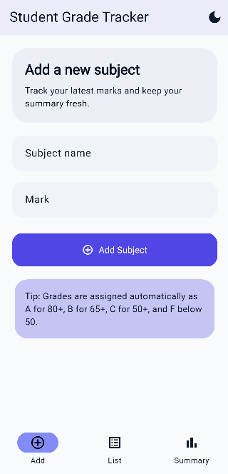
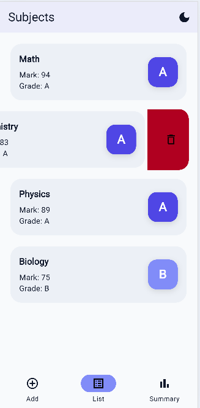
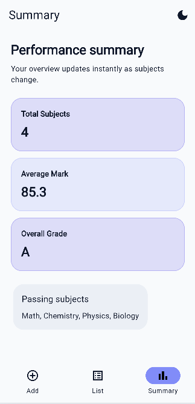
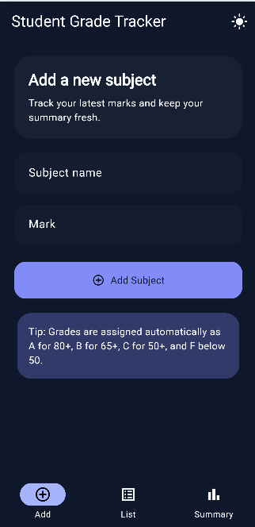
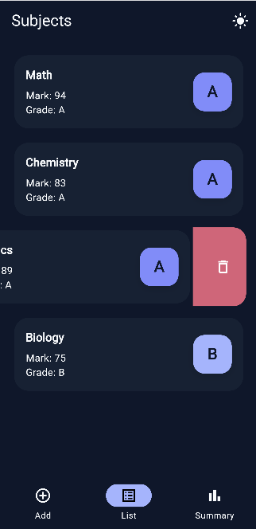
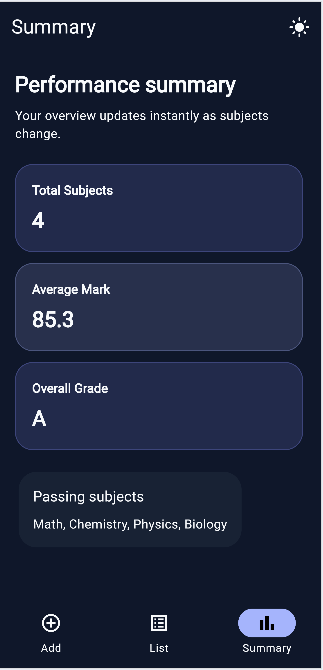

# Student Grade Tracker App

A simple Flutter app for tracking subjects, marks, and grade summaries.

## Features

- Add subjects with validation for subject name and marks from 0 to 100.
- View all saved subjects in a list with grade information.
- Swipe to delete subjects from the list.
- See a live summary with total subjects, average mark, and overall grade.
- Toggle between light and dark themes using custom theme data.

## Architecture

The app uses a simple clean architecture with a feature-based structure:

- core/constants for shared constants
- core/theme for custom theme definitions
- features/subjects for the subject model, provider state, and screens

## Run locally

1. Install Flutter.
2. Run `flutter pub get`.
3. Start the app with `flutter run`.

## Testing

Run:

- `flutter test`
- `flutter analyze`

## Snapshots

App screenshots of the three main screens below:

  
  
  

## Dark mode

  
  
  

